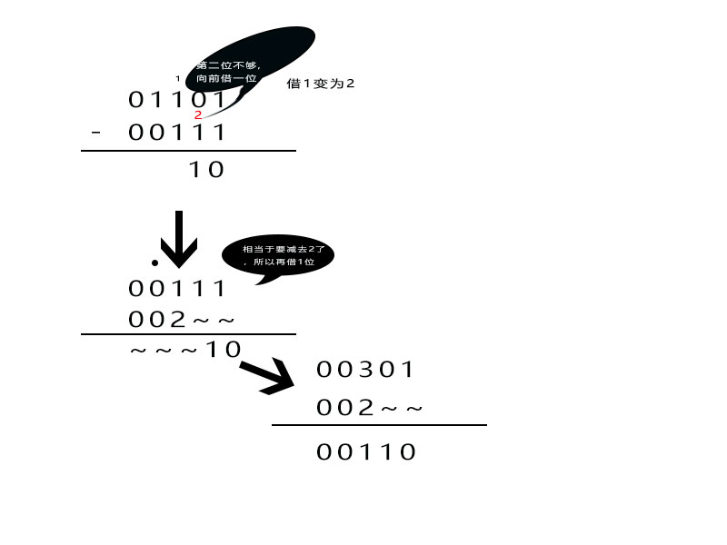
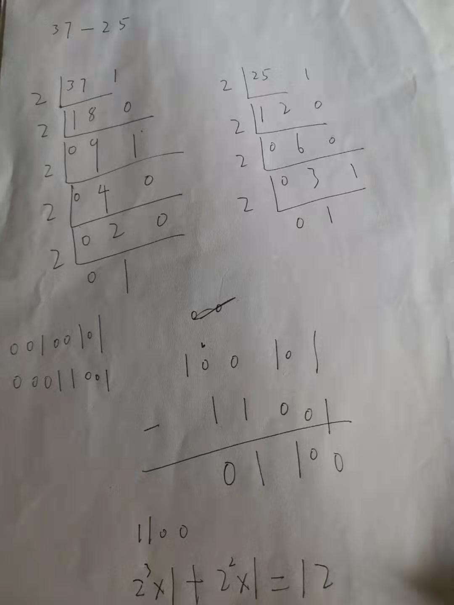

#### 位运算


+ 十进制转二进制

+ 正整数十进制转二进制

> 正整数转成二进制。要点一定一定要记住哈：除二取余，然后倒序排列，高位补零。也就是说，将正的十进制数除以二，得到的商再除以二，依次类推知道商为零或一时为止，然后在旁边标出各步的余数，最后倒着写出来，高位补零就OK咧。

```
   2 |93     1
    ──────
   2 |46     0
    ──────  
   2 |23     1
    ──────
   2 |11     1
    ────── 
     2|5     1
     ────
     2|2     0
     ────
       1       
1011101
不满足8位所以高位补0 计算机内部表示数的字节单位是定长的，如8位，16位，或32位。所以，位数不够时，高位补零
01011101
反推回去
1011101
6543210 ==> 2(6)*1+2(5)*0+2(4)*1+2(3)*1+2(2)*1+2(1)*0+2(0)*1 ==》Math.pow(2,6) + Math.pow(2,4) + Math.pow(2,3) +Math.pow(2,2)+1=93


   2 |100    0
   ───────
   2 |50     0
    ──────  
   2 |25     1
    ──────
   2 |12     0
    ────── 
     2|6     0
     ────
     2|3     1
     ────
       1       
01100100


   2 |73     1
    ──────
   2 |36     0
    ──────  
   2 |18     0
    ──────
   2 |9     1
    ────── 
     2|4     0
     ────
     2|2     0
     ────
       1       
1001001

```

+ 负整数转换成二进制

> 先是将对应的正整数转换成二进制后，对二进制取反，然后对结果再加一


```
  2 |87     1
    ──────
   2 |43    1
    ──────  
   2 |21    1
    ──────
   2 |10    0
    ────── 
     2|5    1
     ────
     2|2     0
     ────
       1    

1010111 ==> 补位 01010111  
取反
10101000
加1
10101001
System.out.println( Integer.toBinaryString(-87)); ==>11111111111111111111111110101001 (32位) 去除多余的得到 10101001
```


+ 二进制加法

> 先把两个数对齐，和十进制计算时候的第一步一样，从最右边对齐的上下两个数开始，1+0=1，0+0=0。

> 如果两个数不是都是1，直接相加就可以了，写在下面，1=1=10，把1写上面，把0写下面。

> 1+1+1=11，要注意进位，依此类推，计算完成。(必须近卫实际上可以看作)

```
 2 |2034     0 
 ────────────
 2 |1017     1
 ────────────
 2 |0508     0
 ────────────
 2 |0254     0
 ────────────
 2 |0127     1
 ────────────
 2 |0063     1 
 ────────────
 2 |0031     1
 ────────────
 2 |0015     1
 ────────────
 2 |0007     1
 ────────────
 2 |0003     1
 ────────────
       1    
 2034 二进制011111110010
 128 二进制10000000
    0 1 1 1 1 1 1 1 0 0 1 0
  +         1 0 0 0 0 0 0 0
   ──────────────────────
  0 1 0 0 0 0 1 1 1 0 0 1 0
  ==>2162
```

* 二进制减法





* 二进制乘法

> 按照乘法，0*0=0，0*1=0，1*1=1，进行运算，1001*0101=0101101

**32x24**
```
2 |32     0 
────────────
2 |16     0
────────────
2 |8     0
────────────
2 |4     0
────────────
2 |2     0
────────────
   1
   
32 = 100000

2 |24     0 
────────────
2 |12     0
────────────
2 |6     0
────────────
2 |3     1
────────────
   1
   
 24 = 11000
 
```

|      |      |       |      |      |       |      |      |       |       |
|:---:| :---:| :----: |:---:| :---:| :----: |:---:| :---:| :----: | :----: |
|  |   |   |  | 1|  0 | 0| 0|  0| 0  |
|X  |   |   |  |  |  1 | 1| 0|  0| 0  |
|___|___| ___|___| ___|  ___| ___|___| ___| ___|
|  |   |   |  | 0|  0 | 0| 0|  0| 0  |
|  |   |   |0 | 0|  0 | 0| 0|  0|   |
|  |   | 0 |0 | 0|  0 | 0| 0|  |   |
|  |  1 | 0 |0 | 0|  0 | 0|  |  |   |
|  1|  0 | 0 |0 | 0|  0 | |  |  |   |
|___|___| ___|___| ___|  ___| ___|___| ___| ___|
|  1| 1 | 0 |0|0| 0| 0| 0| 0| 0 |

```
32x24 == > 100000 * 11000 = 1100000000 = 768
```


+ 按位与运算符(&)
> 参加运算的两个数据，按二进制位进行 "与" 运算。
> 运算规则： 0&0=0; 0&1=0; 1&0=0; 1&1=1; 即：两位同时为 “1，结果才为 ” “1，否则为 ” 0
```
    6 & 8 == 0
    1  0  0  0
    0  1  1  0
    --------
    0  0  0  0
    
    3&5 即 0000 0011 & 0000 0101 = 0000 0001 因此， 3&5 的值得 1。
```

[二进制如何转十进制，十进制如何转二进制](https://jingyan.baidu.com/article/597a0643614568312b5243c0.html)

[二进制怎样相加](https://jingyan.baidu.com/article/86112f135745432736978776.html)

[二进制怎么进行减法相减](https://jingyan.baidu.com/article/851fbc379ef4173e1e15ab71.html)

[从java toBinaryString() 看计算机数值存储方式（原码、反码、补码）](https://www.cnblogs.com/simpleito/p/10787827.html)


### [回到Java的程序结构](programStructure.md)