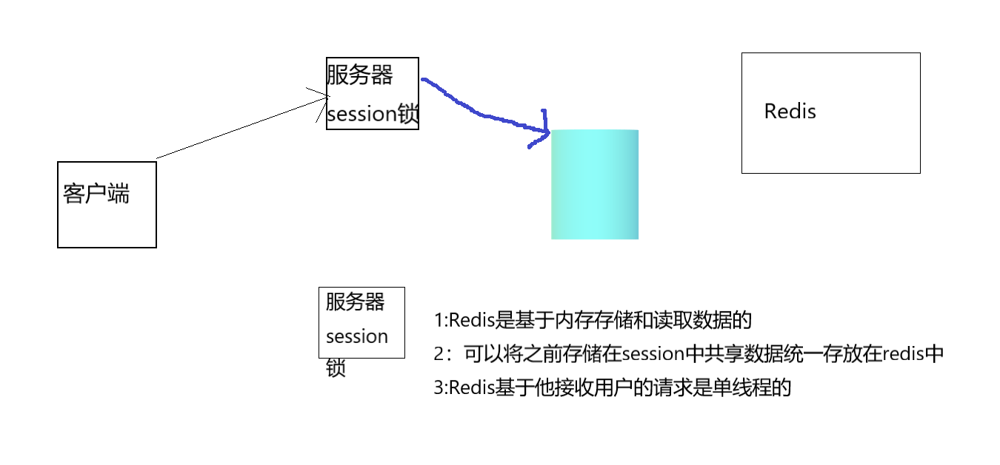

# 一.Redis介绍
### 1.1引言

> 1:由于用户量大，请求了随之增大，数据压力过大。
> 2:多台服务器之间数据不同步
> 3:多台服务器之间的锁已经不存在互斥性了


# 


### 1.2 NOSQL
> redis就是nosql

> 非关系数据库 > not only sql 
>> 1:key-value redis
>> 2:文档型 solr,Mongodb,ElasticSearch
>> 3:面向列 Hbase(一般大数据)
>> 4:图形化 Neo4j

### 1.3 redis介绍

> Redis（Remote Dictionary Server )，即远程字典服务，是一个开源的使用ANSI C语言编写、支持网络、可基于内存亦可持久化的日志型、Key-Value数据库，并提供多种语言的API。
  Redis是一款基于Key-Value的NOSQL，而且Redis是基于内存存储数据的,Redis还提供了多种持久化机制，Redis还提供了主从、哨兵以及集群的搭建方式，可以更方便的横向扩展以及垂直扩展


> 操作都是原子的
>
> > 所有 Redis 的操作都是原子的，从而确保当两个客户同时访问 Redis 服务器时，得到的是更新后的值（最新值）。在需要高并发的场合可以考虑使用 Redis 的事务，处理一些需要锁的业务。


# 二.Redis安装


# 三.Redis命令

```
 keys * 获取所有的key
 clear 清除屏幕
 quit ,exit 退出
 set name blake 设置值
  setex ip 5 192.1.1.168 设置值并且设置过期时长
 get name 取出值
  del name 删除key所对应的值
   exists key 判断是否存在key
   mset key1,key2...设置多个值
   mget key1,key2...取出多个值
    append age 1 追加key的value
    strlen key 获取某个key的value的长度
  
  select index 选择数据库 (注意redis一共16个数据库 并且从0开始)
  move key db或者 move key index (redis一共16个数据库  move age 7) 将某个key移动到某个数据库中
   flushdb 清除当前数据库
   flushall 清除16个数据库
  type key 获取数据类型 (type name == > string)
```


### 3.1 redis存储数据结构

+ 字符串列表 key-string
+ 无序不重复的字符串集合 key-set
+ 有序不重复的字符串集合 key-list
+ 键、值都为字符串的哈希表 key-hash
+ 有序集合 key-zset

### 3.2存储结构用处

+ key-string :最常用的，一般用于存储一个值
+ key-hash:存储一个对象数据的
+ key-list:使用list结构实现栈和队列结构
+ key-set: 交集、差集、并集操作
+ key-zset : 排行榜,积分存储


## [回到Java首页](../index.md)