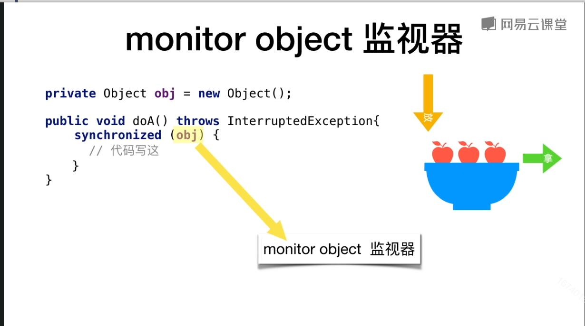

### synchronized


> synchronized可以保证方法或者代码块在运行时，同一时刻只有一个方法可以进入到临界区，同时它还可以保证共享变量的内存可见性


+ **用法:**

```

public synchronized void doSomething(){
    //这里的代码不会同时有几个线程执行
}
synchronized (this){
     //这里的代码也不会有几个代码同时执行      
}
```

+ **synchronized监视器**
+ **synchronized(object) object是监视器**
+ **被synchronized修饰的方法**
+ **静态方法:监视器是所属类的class对象**
+ **非静态方法:监视器是this**
+ **同一个监视器内所以代码都是同步的,不论是否在同一函数、同一类内如:**



+ 监视器不要使用Long,Integer等基本类型对象做监视器这样不好

```
public synchronized void methodA(){
        
}
public synchronized void methodB(){
        
}
public void methodC(){
    synchronized (this){
              
    }
}
//如果有一个线程已经运行ABC三处中的任意一个代码块，那么其它线程都不能执行这三个代码块的任意一个地方
```

+ __下面是一些监视器__

```
public class Sync {

    public void doA(){
        synchronized (this){
            //A      监视器Sync.this
        }
    }

    public synchronized void doB1(){
        //B1 监视器Sync.this
    }

    public synchronized void doB2(){
        //B2 监视器Sync.this
    }

    public static synchronized void doC(){
        //C 监视器 Sync.class
    }

    public   void doD(){
        synchronized (Sync.class){
            //D 监视器 Sync.class
        }
    }

}
```

+ **关于同步的一些写法**
```
 private Object object = new Object();

    public void doA()throws InterruptedException{
        object.wait();//错误用法 会抛出无效的异常监视器状态
    }

    public void doB(){
        object.notify();//错误用法
    }
```

+ **正确用法**

```
private Object object = new Object();

public void doA() throws InterruptedException {
    synchronized (object) {//获得锁
        object.wait();//释放锁,待其它线程notify或者notifyAll后重新获得锁后继续运行
    }//释放锁
}

public void doB() {
    synchronized(object){//获得锁
        object.notify(); //通知一个被wait此监视器的线程
    }//释放锁
}
```

+ **一个例子下面程序输出多少**

```
public class MonitorObject {

    private Object object = new Object();

    public void doA()throws InterruptedException{
        synchronized (object){
            System.out.println("1");
            object.wait();
            System.out.println("2");
        }
    }

    public void doB()throws InterruptedException{
        synchronized (object){
            System.out.println("3");
            object.notify();
            Thread.sleep(500);
            System.out.println("4");
        }
    }

    public static void main(String[] args) {
        MonitorObject mo = new MonitorObject();
        Thread t1 = new Thread(new Runnable() {
            @Override
            public void run() {
                try {
                    mo.doA();
                } catch (InterruptedException e) {

                }
            }
        }, "t1");

        Thread t2 = new Thread(new Runnable() {
            @Override
            public void run() {
                try {
                    mo.doB();
                } catch (InterruptedException e) {

                }
            }
        }, "t2");

        t1.start();
        try {
            Thread.sleep(100);
        } catch (InterruptedException e) {

        }
        t2.start();
    }

}

```

+ **[解答](./synchronized.answer.md)**


### [回到Java多线程首页](index.md)