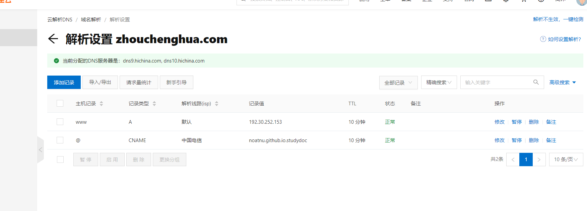
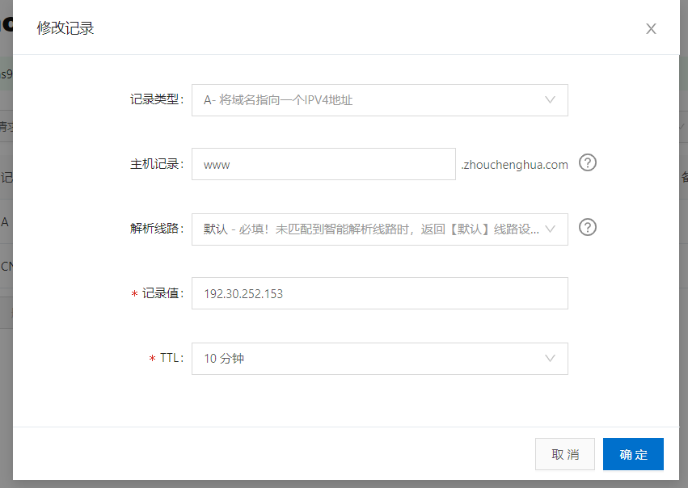
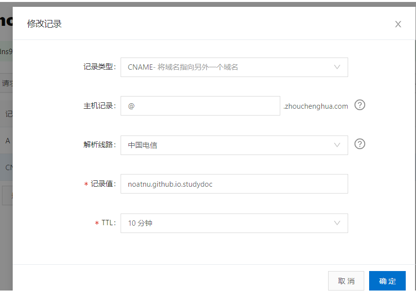
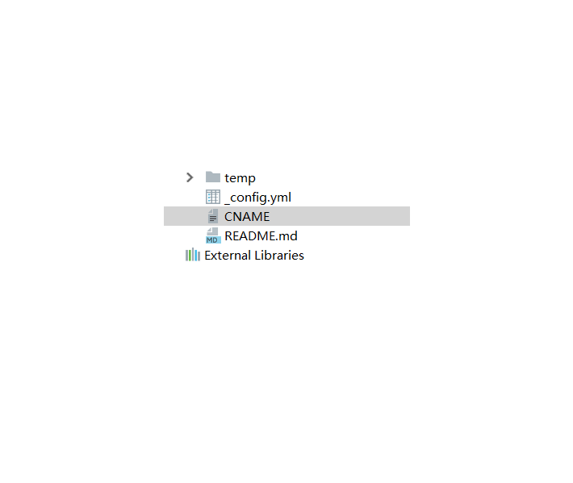
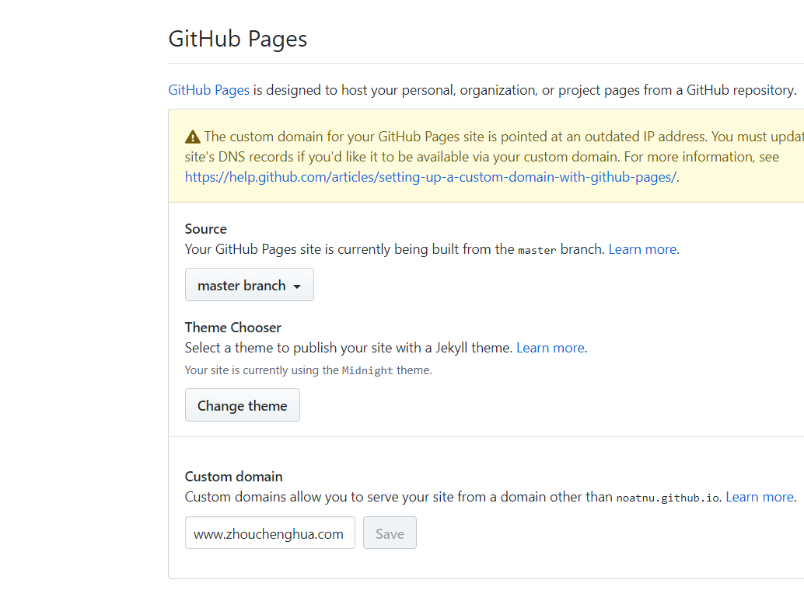

+ 原教程但是由于他使用的github的用户名做的域名映射器,这样不好的地方是有可能你使用自定义的方式建立github仓库名比如 English study,还有一个是他使用的阿里云的域名映射解析这些是老版本的

+ [GitHub Pages 绑定来自阿里云的域名==原博客教程](https://blog.csdn.net/qq_29232943/article/details/52786603)  


## 我的使用
## github url ==> https://github.com/noatnu/studyDoc , 买的域名 http://www.zhouchenghua.com/




+ 解析第一个设置



+ 创建A记录，请将您的顶点域指向GitHub Pages的IP地址  https 解析ip,上面的192.30.252.153是http解析方式现在官方已经宣布过时了,选择下面任意一个都可以
```
185.199.108.153
185.199.109.153
185.199.110.153
185.199.111.153
```

+ 解析第二个设置




+ github 要做的事

+ 创建 CNAME文件,写入www.zhouchenghua.com



+ 这个是我设置github project 设置截图



+ ping 地址

```
C:\Users\noatn>ping www.github.com

正在 Ping github.com [13.250.177.223] 具有 32 字节的数据:
请求超时。
请求超时。
请求超时。
请求超时。

13.250.177.223 的 Ping 统计信息:
    数据包: 已发送 = 4，已接收 = 0，丢失 = 4 (100% 丢失)，

C:\Users\noatn>ping www.github.com.noatnu.studyDoc

正在 Ping www.github.com.noatnu.studyDoc [223.87.179.156] 具有 32 字节的数据:
来自 223.87.179.156 的回复: 字节=32 时间=872ms TTL=54
来自 223.87.179.156 的回复: 字节=32 时间=10ms TTL=54
来自 223.87.179.156 的回复: 字节=32 时间=7ms TTL=54
来自 223.87.179.156 的回复: 字节=32 时间=8ms TTL=54

223.87.179.156 的 Ping 统计信息:
    数据包: 已发送 = 4，已接收 = 4，丢失 = 0 (0% 丢失)，
往返行程的估计时间(以毫秒为单位):
    最短 = 7ms，最长 = 872ms，平均 = 224ms


```
+ 223.87.179.156这是我的静态博客地址 223.87.179.156

+ 192.30.252.153 还可以改为223.87.179.156 ,不过不建议改 因为我们自己查出的ip不是固定ip 而 92.30.252.153是Github Pages服务器指定的IP地址，访问该IP地址即表示访问Github Pages

+ 现在ipv4已经分配完了,虽然北美，日本，欧洲，韩国，香港等地的企业商 还有ipv4申请但是其实是他们以前申请保留下来的


+ 按照我上面的截图设置即可 ,然后把我的github  project url 下载下来看一下


+ 所以设置完毕会等一段时间,大概至少会超过1个小时,因为这里面牵扯到阿里云的解析是否解析了你的域名映射,当然这不包括你的域名购买时间，注册以及实名认证这些时间,虽然官方说的时间是挺短的,当你做这些才会一声叹息啊


## [回到解决问题](index.md)