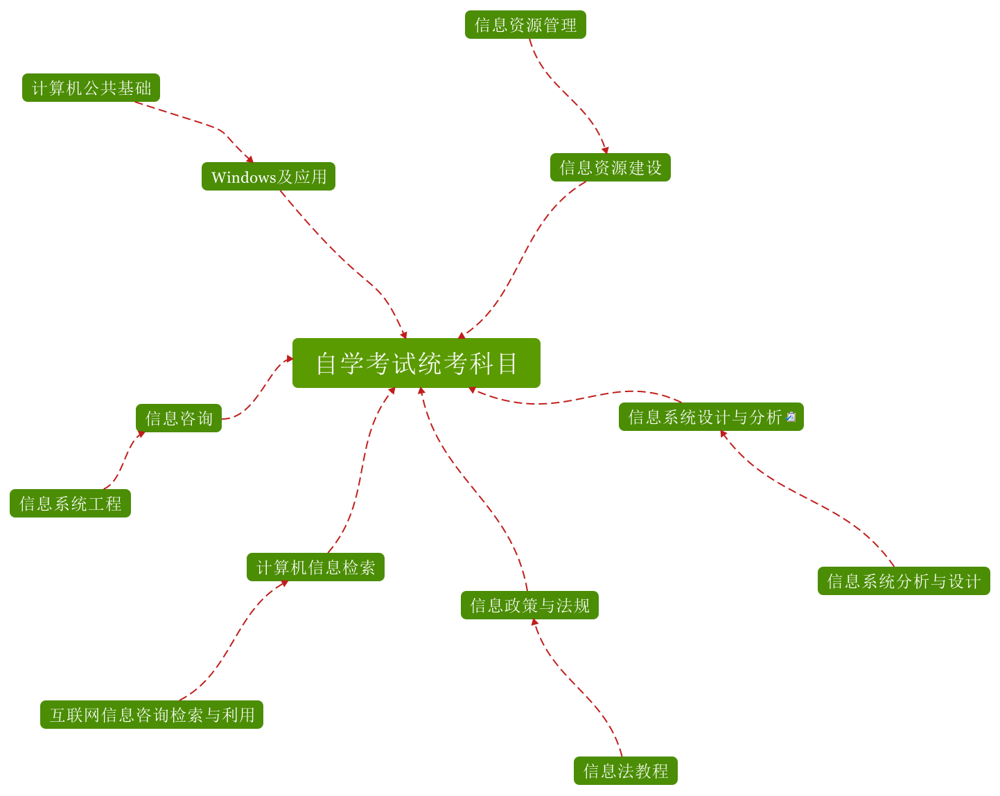

## 信息管理与服务 统考科目

# [Windows及应用](Windows及应用/index.md)

# [信息咨询](信息咨询/index.md)

# [信息政策与法规](信息政策与法规/index.md)

# [信息系统设计与分析](信息系统设计与分析/index.md)

# [信息资源建设](信息资源建设/index.md)

# [计算机信息检索](计算机信息检索/index.md)

__

# [网络工程](网络工程/index.md)

# [回到上级目录](../index.md)