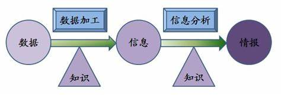
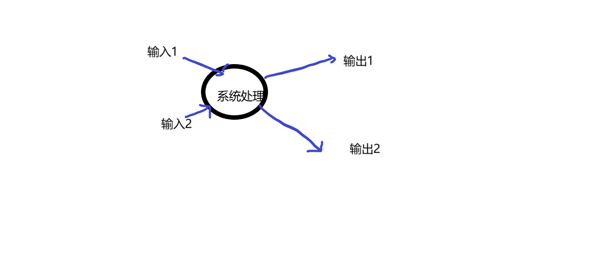

# 信息系统概述

## 信息


+ 什么是社会的标志

+ 答:信息是当今社会的标志

###  一:信息的含义 (填空题，单选题，简答题)

+ 1:) 信息的存在不以主体(如人、生物或机器系统) 存在为转移,即使主体根本不存在，信息也可以存在，他在客观上反映某一客观事物的现实情况。

+ 2:) 信息在主观上可以接受和利用，并指导人们的行动。

```
信息与数据是信息系统中最基本的术语 ;

信息是数据加工的结果,是数据的含义，而数据是信息的载体;
```




###  二:信息的性质 (简答题)

> 一共分为6个方面


+ 1:) 客观性 (信息的核心)

```
客观性也称事实性
```

+ 2:) 时效性

```
信息的时效性是指从信息源发送信息，经过接收、加工、传递和利用所经历的时间间隔及其效率。
```

> 时间间隔越短，使用信息越及时，使用程度越高，则时效性越强。


+ 3:) 等级性

```
信息系统是分等级的，对一同一问题，处于不同管理层次，所要求的信息不同。
分为:战略级、管理级、操作级
```

+ 4:) 扩散性

```
信息的扩散是其本性，它总是力图冲破保密的非自然约束，通过各种渠道和手段向四面八方传播。
信息的扩散存在两面性，一方面它有利于知识的传播，另一方面可能造成信息的贬值
```

+ 5:) 可传递性

```
信息在扩散的过程中，可以通过多种传输渠道、采用多种传输方式进行传递。
```


+ 6:) 价值性


```
信息是经过加工的、有意义的数据，是一种资源，因而是有价值的
```


## 信息系统

+ 信息系统工作的好坏与整个组织的效益关系极大，可以说信息系统是整个系统的神经系统


###  一:系统的概念

+ 什么是系统

+ 答:系统是为了达到某种目的而对单一群单元作出有规律的安排，使之成为一个相关联的整体

> 系统必须依赖于环境而存在，不能孤立。系统与其环境之间相互交流，相互影响。

+ 一个实际物理模型从宏观上来看有输入、处理和输出三部份




###  二:信息系统的概念


## [回到上一级](./index.md)